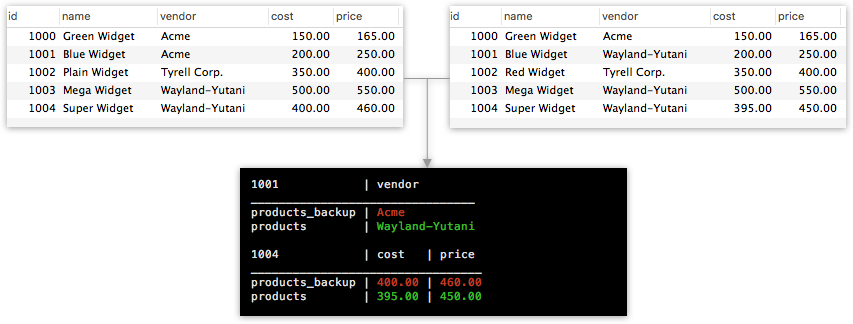

# DBDiff

Diffs for your SQL database tables. DBDiff lets you compare the contents of any two tables.

	$diff->connect($pdo)
		->compare($columns)
		->from('products_backup', 'products')
		->where('vendor', 'Wayland-Yutani')
		->output();

## Requirements

DBDiff requires PHP 7.1 or above.

## Installation

Install with Composer:

	$ composer require gbradley/dbdiff

## Usage

- [Connecting to the database](#connecting-to-the-database)
- [Specifying columns to compare](#specifying-columns-to-compare)
- [Specifying tables](#specifying-tables)
- [Adding constraints](#adding-constraints)
- [Primary key](#primary-key)
- [Results](#output-results)
- [Fuzzy matching](#fuzzy-matching)

Note: with the exception of the "final" methods such as `output()`, `each()` and `count()`, DBDiff methods are chainable for a fluent interface.

### Connecting to the database

Start by creating an instance of DBDiff and passing a configured PDO connection in the constructor:

	$pdo = new PDO(...);
	$diff = new DiffFB($pdo);
	
If you use a framework with dependency injection such as Laravel, you can instead pass the PDO connection separately with `connect`:

	someMethod(DBDiff $diff) {
		$diff->connect(DB::connection()->getPdo());
	}
	
### Specifying columns to compare

Next, use the `compare()` method to specify an array of table columns you wish to compare.

	$diff->compare([
		'name',
		'vendor',
		'cost',
		'price',
		'last_updated'
	]);
	
### Specifying tables

Tell DBDiff which tables you're accessing with the `from()` method:

	$diff->from('products_backup', 'products');

Using terminology from Git, the first argument is the *source* and the second is the *destination*.
	
To specify the database where your tables are located, pass the database name as the third argument. If your tables are in different databases, pass the *source* and *destination* databases in the 3rd and 4th arguments.

	$diff->from('products', 'products', 'db_backup', 'db');
	
### Add constraints

You may only be interested in a subset of the data in your table. If so, use `where()` to limit results to rows where the condition is true in either table:

	$diff->where('vendor', 'Wayland-Yutani');
	
### Primary key

By default the primary key on your tables is assumed to be `id`, but you may override this with `primaryKey()`:

	$diff->primaryKey('product_id');
	
### Results

By default, calling `output()` will compute the diff and echo the results. Each result in the diff is shown with the ID and the columns & values which differed between tables.

To do something else with each result, pass a method to `output()` which accepts a single result.

	$diff->output(function($result) {
		Log::info($result);
	});

#### Customizing the output format

When using `output()`, the `DBDiff\Formatter` class is used to format the results for each diff. If needed, you may subclass Formatter and provide an instance of your class to the `format()` method:

	$diff->format(new MyCustomFormatter);
	
#### Accessing raw data

Of course, you may wish to avoid formatting completely and access the raw data from each diff. To do so, call the `each()` method, passing a function which accepts the ID and source & destination arrays:

	$diff->each(function($id, $source, $destination) {
		...
	});
	
For each computed diff, this function will be passed the columns & values from each table where the values differ.

#### Counting results

Both the `output()` and `each()` methods return the number of diff results, but if you wish to obtain this number without processing the records, use `count()` instead. This utilises SQL's `COUNT` aggregate function to avoid returning large amounts of data to your server.

### Fuzzy matching

DBDiff uses your underlying database for comparison, which will typically involve strict comparison. This is perfect for some use-cases, such as comparing changes between backups. However, at other times you may want to be more tolerant of differences in your data.

Imagine you're importing a user-generated contact list into an existing database. As well as finding new contacts, you want to detect cases where the contact has changed. However, your list has been generated by a human, and may contain typing errors and other minor differences you want to ignore.

For example, we can get DBDiff to ignore leading & trailing whitespace by telling the `usingModifiers()` method to run the native `trim()` function on the desired column:

	$diff->usingModifiers([
		'name' => 'trim'
	]);
	
If you specify multiple functions, they will be run in sequence. To perform a case-insensitive comparison after trimming whitespace:

	$diff->usingModifiers([
		'name' => ['trim', 'mb_strtolower']
	]);
	
You may also provide your own functions. For example, if some of your names are prefixed with titles, you can ignore them:

	$titles = '/^(mr|mrs|dr)\s+/';
	$ignore_titles = function($value) use ($titles) {
		return preg_replace($titles, '', $value);
	};
	
	$diff->usingModifiers([
		'name' => ['trim', 'mb_strtolower', $ignore_titles]
	]);